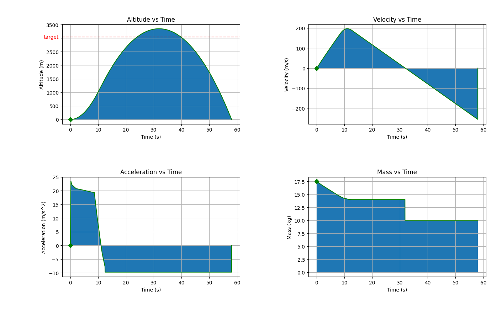

## Simulation
A 1D simulation of the rocket launch, used to help answer high-level design questions and determine constraints for future work.

### Requirements
[Python](https://www.python.org/downloads/)(>3.6.6)

in addition to the following projects:

* [numpy 1.18.2](https://pypi.org/project/numpy/)
* [thrustcurve 0.1.0](https://pypi.org/project/thrustcurve/)
* [matplotlib 3.2.1](https://pypi.org/project/matplotlib/)
* [ambiance 1.0.0](https://pypi.org/project/ambiance/)

which can be installed with:
    
    pip install -r requirements.txt

### Run
To run the simulation, run:

    python3 ./src/main.py 
